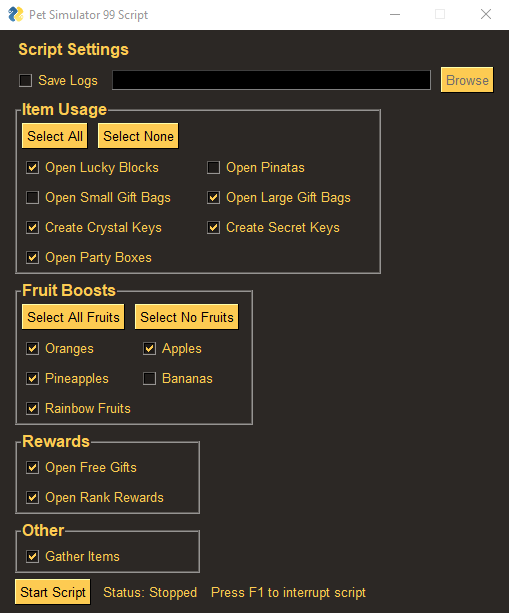

## Pet Simulator 99 Script

#### This is a script for the Roblox game, Pet Simulator 99 (PS99).

#### It uses image recognition from PyAutoGui to identify PS99 images and uses their position to automate mouse movement and clicks.

